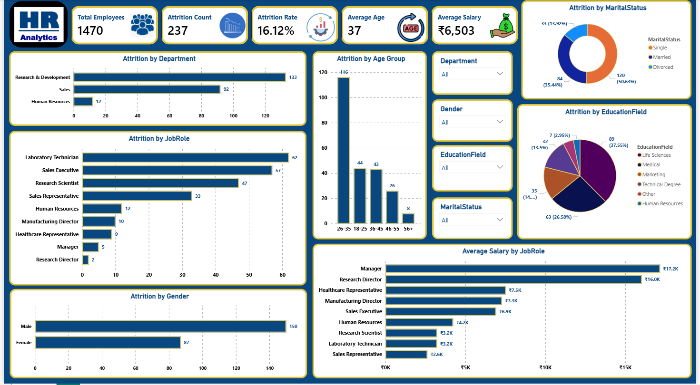

# 📊 HR Analytics Dashboard (Power BI)

## 📌 Project Overview
This project analyzes employee attrition using Power BI. It provides HR teams with insights into employee turnover, salary distribution, department-wise attrition, and workforce demographics.

---

## 📈 Dashboard KPIs
- Total Employees
- Attrition Count
- Attrition Rate
- Average Age
- Average Salary

---

## 📊 Dashboard Insights
- Research & Development department has the highest employee attrition.
- Laboratory Technicians have the highest attrition among job roles.
- Male employees have higher attrition than female employees.
- Employees aged 26–35 show the highest attrition.
- Life Sciences has the highest attrition among education fields.
- Managers have the highest average salary.

---

## 🛠 Tools Used
- Power BI
- Power Query
- DAX
- Microsoft Excel

---

## 📂 Files Included
- HR-Analytics-PowerBI-Dashboard.pbix
- HR-Employee-Attrition.csv
- Dashboard Screenshot

---

## 📸 Dashboard Preview

